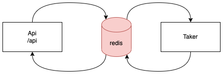

# TAKER

Utilizando de uma interface de api REST, o Taker tem como objetivo buscar dados 
processuais de processos judiciais de tribunais brasileiros baseados no e-SAJ.

Tribunais suportados:
- [TJAL 1º grau](https://www2.tjal.jus.br/cpopg/open.do)
- [TJAL 2º grau](https://www2.tjal.jus.br/cposg5/open.do) (em progresso)
- [TJCE 1º grau](https://esaj.tjce.jus.br/cpopg/open.do) (em progresso)


> Para alterar a image, importe o arquivo ".xml" na plataforma https://app.diagrams.net/

Passado o número do processo para a api, esse número será adicionado no redis 
que atua como um mensageiro entre a api e a aplicação que busca os dados
do processo nos sites dos tribuinais.

O taker, então identificará de qual tribunal se trata o número de processo
e fará a busca.

### Por que o falcon?

Como se trata de uma aplicação que precisa de apenas um endpoint, optou-se pelo
 falcon por ser um pacote leve e simples.

Apesar da simplisidade, o sistema foi desenvolvimento de forma modularizada
para que, se conveniente, as peças sejam trocadas por outras.

### Por que o redis?

Novamente pela simplicidade.

### Por que requests e beautifulsoup

Pacotes leves e poderosos para a construção de crawlers.

Além disso, o Taker foi desenvolvido de tal forma que se torna simples
adicionar novos tribunais.

### Oportunidades de melhoria

- Transformar o processo assíncrono tanto na api quanto no taker.

## Prerrequisitos

- python 3.11
- docker
- docker-compose

## Como rodar a aplicação

Na raiz do projeto, execute:
```
make start
```

## Modo de usar

O principal endpoint é o http://localhost:8000/api.
```
curl --request POST \
  --url http://localhost:8000/api \
  --header 'Content-Type: application/json' \
  --data '{
	"process_number": "0710802-55.2018.8.02.0001"
}'
```

A resposta será similar a seguinte:
```
[
	{
		"classe": "Procedimento Comum Cível",
		"area": "Cível",
		"assunto": "Dano Material",
		"data_distribuicao": "02/05/2018 às 19:01 - Sorteio",
		"juiz": "José Cícero Alves da Silva",
		"valor_acao": "281.178,42",
		"partes_processo": {
			"autor": {
				"parte": "José Carlos Cerqueira Souza Filho",
				"advogados": [
					"Vinicius Faria de Cerqueira"
				]
			},
			"autora": {
				"parte": "Livia Nascimento da Rocha",
				"advogados": [
					"Vinicius Faria de Cerqueira"
				]
			},
			"ré": {
				"parte": "Cony Engenharia Ltda.",
				"advogados": [
					"Carlos Henrique de Mendonça Brandão ",
					"Guilherme Freire Furtado ",
					"Maria Eugênia Barreiros de Mello ",
					"Vítor Reis de Araujo Carvalho"
				]
			},
			"réu": {
				"parte": "Banco do Brasil S A",
				"advogados": [
					"Nelson Wilians Fratoni Rodrigues"
				]
			}
		},
		"lista_movimentacao": [
			{
				"data": "22/02/2021",
				"movimento": "Remetido recurso eletrônico ao Tribunal de Justiça/Turma de recurso"
			},
            {
				"data": "02/05/2018",
				"movimento": "Distribuído por Sorteio"
			}
		]
	}
]
```

## Contribuições

### Instale as dependências de desenvolvimento

Crie um ambiente virtual e instale as dependências. Exemplo:
```
python -m venv .venv
source .venv/bin/activate
make install-dev
```

### Executando os testes

Para rodar os testes unitários execute:
```
make test
````

